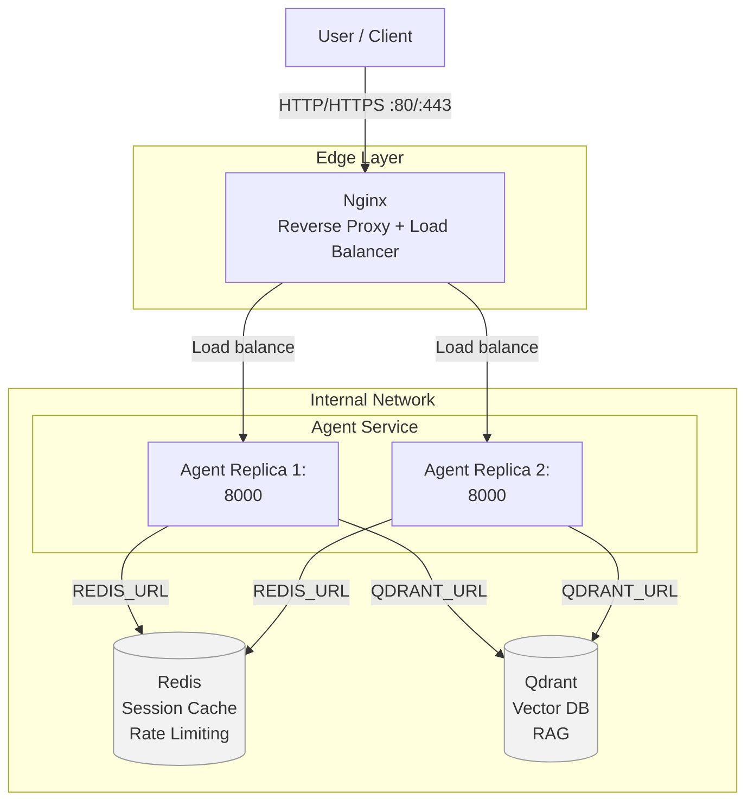
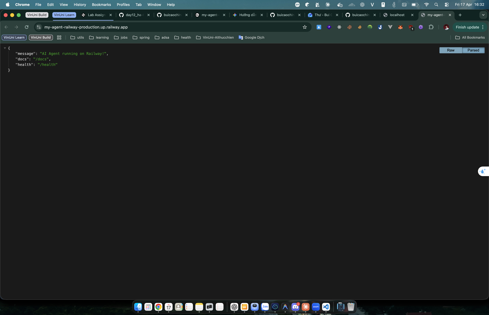

# Day 12 Lab - Mission Answers

## Part 1: Localhost vs Production

### Exercise 1.1: Anti-patterns found
**Câu hỏi:** Đọc `app.py` và tìm ít nhất 5 vấn đề.
1. **Hardcoded Secrets**: API Key (`OPENAI_API_KEY`) và Database URL được viết trực tiếp trong mã nguồn, dễ bị lộ khi push code lên Git.
2. **Fixed Port & Host**: Chạy cố định trên `localhost:8000`, khiến app không thể chạy trong môi trường container hoặc cloud (nơi PORT được cấp phát động).
3. **Debug Mode in Production**: Sử dụng `reload=True` của uvicorn, gây lãng phí tài nguyên và rủi ro bảo mật trong môi trường production.
4. **Poor Logging**: Sử dụng `print()` thay vì thư viện logging chuyên nghiệp, không hỗ trợ log level và cấu trúc (JSON) để phân tích sau này.
5. **No Health Checks**: Thiếu các endpoint `/health` hoặc `/ready`, khiến các nền tảng điều phối (Orchestrator) không biết khi nào app bị treo để khởi động lại.

### Exercise 1.3: Comparison table
**Câu hỏi:** So sánh 2 files `app.py` giữa `develop` và `production`.
| Feature | Develop | Production | Why Important? |
|---------|---------|------------|----------------|
| Config  | Hardcode | Environment Variables | Giữ bí mật các thông tin nhạy cảm và linh hoạt thay đổi config theo môi trường. |
| Health check | ❌ | ✅ (/health, /ready) | Tự động phát hiện lỗi và duy trì tính sẵn sàng của dịch vụ. |
| Logging | print() | JSON Structured | Dễ dàng thu thập và phân tích dữ liệu log tập trung bởi các hệ thống giám sát. |
| Shutdown | Đột ngột | Graceful Shutdown | Đảm bảo các request đang xử lý không bị ngắt quãng giữa chừng gây lỗi dữ liệu. |

## Part 2: Docker

### Exercise 2.1: Dockerfile questions
**Câu hỏi:** Đọc `Dockerfile` và trả lời:
1. Base image là gì?
2. Working directory là gì?
3. Tại sao COPY requirements.txt trước?
4. CMD vs ENTRYPOINT khác nhau thế nào?

**Trả lời:**
1. **Base image**: `python:3.11` (Bản phân phối đầy đủ, dung lượng lớn, khoảng 1GB).
2. **Working directory**: `/app`.
3. **Tại sao COPY requirements.txt trước?**: Để tận dụng Docker Layer Caching. Nếu chỉ sửa code mà không sửa dependency, Docker sẽ bỏ qua bước cài đặt (pip install) giúp build nhanh hơn rất nhiều trong các lần build sau.
4. **CMD vs ENTRYPOINT**:
   - `CMD`: Cung cấp các tham số mặc định cho container, có thể bị ghi đè dễ dàng khi chạy lệnh `docker run`.
   - `ENTRYPOINT`: Xác định lệnh chính thức sẽ luôn chạy khi khởi động container, thường dùng cho app chính và khó bị ghi đè hơn.

### Exercise 2.3: Image size comparison
**Câu hỏi:** Đọc `Dockerfile` (production) và tìm: Stage 1 làm gì? Stage 2 làm gì? Tại sao image nhỏ hơn? So sánh size.

**Trả lời:**
- **Develop**: ~1.16 GB (Dùng base image Python full).
- **Production**: ~186 MB (Dùng `python:3.11-slim` và multi-stage build).
- **Difference**: Giảm khoảng 84% dung lượng.
- **Stage 1 (Builder)**: Cài đặt các công cụ build (gcc, libpq-dev) và dependencies.
- **Stage 2 (Runtime)**: Chỉ copy các thư viện đã cài đặt sang một image sạch (slim), loại bỏ hoàn toàn các file rác và công cụ build (như gcc).

### Exercise 2.4: Docker Compose architecture
**Câu hỏi:** Đọc `docker-compose.yml`. Services nào được start? Chúng communicate thế nào?

**Trả lời:**
- **Services started**: `agent` (app chính), `redis` (cache/rate limit), `qdrant` (vector store), `nginx` (load balancer).
- **Communication**: Nginx nhận traffic từ port 80/443 và phân phối tới các instance của `agent`. Các container `agent` giao tiếp với `redis` và `qdrant` thông qua tên service trong mạng nội bộ (Internal Network).

**Nhiệm vụ:** Đọc `docker-compose.yml` và vẽ architecture diagram.

**Trả lời:**

## Part 3: Cloud Deployment

### Exercise 3.1: Railway deployment
**Câu hỏi:** Test public URL với curl hoặc Postman.
- **URL**: `https://my-agent-railway-production.up.railway.app`
- **Test Result**: Hoạt động ổn định, phản hồi đúng cấu trúc JSON.
- **Screenshot**: 

### Exercise 3.2: Comparison (render.yaml vs railway.toml)
**Câu hỏi:** So sánh `render.yaml` với `railway.toml`. Khác nhau gì?
- `render.yaml` cho phép định nghĩa toàn bộ hạ tầng (Blueprint) bao gồm cả các dịch vụ phụ trợ như Redis.
- `railway.toml` tập trung vào cấu hình runtime và build pipeline của một service đơn lẻ.

## Part 4: API Security

### Exercise 4.1-4.3: Test results
**Câu hỏi:** API key được check ở đâu? Điều gì xảy ra nếu sai key? JWT flow là gì? Algorithm nào được dùng cho Rate Limiting?

**Trả lời:**
- **API Key**: Trả về `401 Unauthorized` nếu thiếu key và `403 Forbidden` nếu key không khớp với `AGENT_API_KEY`.
- **JWT**: Người dùng cần POST tới `/token` lấy Bearer token trước khi gọi `/ask`. Token giúp mã hóa thông tin người dùng và có thời gian hết hạn (expiry).
- **Rate Limiting**: Thuật toán **Sliding Window Counter** được sử dụng. Nếu gọi quá 10 req/phút, server phản hồi lỗi `429 Too Many Requests`.

### Exercise 4.4: Cost guard implementation
**Câu hỏi:** Giải thích cách implement logic `check_budget`.
- **Approach**: Sử dụng Redis để lưu trữ mức chi tiêu (`spending`) theo `user_id` và `tháng hiện tại`. Trước khi gọi LLM, hệ thống kiểm tra ngân quỹ còn lại. Dữ liệu được đặt TTL 32 ngày để tự động reset mỗi tháng.

## Part 5: Scaling & Reliability

### Exercise 5.1-5.5: Implementation notes
**Câu hỏi:** Ghi chú các điểm quan trọng về Health checks, Graceful shutdown, Stateless design, Load balancing.

**Trả lời:**
- **Health Checks**: Đã triển khai `/health` để kiểm tra sự sống và `/ready` để kiểm tra kết nối Redis/DB.
- **Graceful Shutdown**: Bắt tín hiệu `SIGTERM`, dừng nhận request mới và đợi tối đa 30s cho các request đang xử lý hoàn thành.
- **Stateless Design**: Thay thế hội thoại trong biến global sang lưu trữ trong Redis. Giúp mở rộng số lượng container chạy song song mà không mất dữ liệu người dùng.
